# Architecture

## Purpose

A commercial/institutional banking Next-Best-Action (NBA) proof of
concept: detect meaningful client events from transaction data, rank them
transparently, and produce evidence-grounded, human-reviewed summaries for
Relationship Managers. See `README.md` for the one-paragraph pitch and
`docs/current_state.md` for what's actually verified working today.

## Pipeline

```mermaid
flowchart LR
    subgraph Source["Configured source"]
        OL[OfflineLocalSource\nDuckDB over CSV]
        SF[SnowflakeSource\nNOT RUN]
    end
    Contract[config/entities.yaml\nsource contract]
    Det[detection_engine/\nlarge_incoming_payment.py]
    Rank[datainsights/ranking.py]
    Nar["datainsights/narrative/\ntemplate.py + ollama_narrator.py"]
    Judge["datainsights/judge/\noffline_judge.py (sampled)"]
    State[(datainsights/state.py\nSQLite)]
    Digest[datainsights/digest.py\nmarkdown RM digest]
    Eval["evaluation/evaluate.py\n(separate role)"]
    GT[["protected_evaluator_only/\ntrigger_events.csv"]]

    OL --> Contract
    SF -.-> Contract
    Contract --> Det
    Det --> Rank
    Rank --> Nar
    Nar --> Digest
    Nar --> Judge
    Rank --> State
    Nar --> State
    Det -.->|"detections"| Eval
    GT -.->|"ground truth\n(evaluator only)"| Eval

    style SF stroke-dasharray: 5 5
    style GT fill:#4a1a1a,stroke:#c44
```

Dashed = not executed / access-restricted. The detector never receives
`trigger_events.csv` — only `evaluation/evaluate.py` reads it, and that
module is deliberately separate code, run separately, per the leakage
boundary described below.

## Configured source -> canonical batches -> detection -> ranking -> narrative -> digest

This is the actual data path, matching the governing project instructions:

1. **Configured source** (`datainsights/sources/`): a `DataSource`
   implementation — `OfflineLocalSource` (DuckDB over local CSVs, active
   today) or `SnowflakeSource` (same interface, NOT RUN — no credentials
   available to this session). Detection code depends only on the
   `DataSource` ABC (`datainsights/sources/base.py`), never on a specific
   backend's client library — swapping backends requires zero changes to
   `detection_engine/`.
2. **Canonical batches**: every read is validated against
   `config/entities.yaml` — a logical contract (grain, primary key, time/
   currency semantics, required vs. optional columns, missing-data policy)
   that both source backends must satisfy. Changing a physical table name
   doesn't automatically make arbitrary data fit this contract; a missing
   required column raises `DataSourceError`.
3. **Deterministic trigger detection**
   (`detection_engine/large_incoming_payment.py`): point-in-time-correct
   (baselines use only strictly-prior transactions — verified by test),
   idempotent (same `detection_id` on rerun), with an explicit cooldown
   suppression pass. Spec written before code:
   `docs/detector_spec_large_incoming_payment.md`.
4. **Transparent baseline ranking** (`datainsights/ranking.py`): an
   explicit, auditable formula (magnitude component + recency decay, both
   weighted and clipped to `[0,1]`) — no ML. Every component is visible in
   the output, not folded into an opaque score.
5. **Evidence-grounded narrative** (`datainsights/narrative/`): a
   deterministic template baseline, and a local-Ollama structured-output
   narrator that can only state facts present in a minimal evidence packet
   (`datainsights/narrative/evidence.py`). Deterministic validation
   (schema conformance, numeric consistency against the evidence packet,
   a banned-claims check for unsupported business interpretations like
   "tender") runs before any LLM output is accepted; failure falls back to
   the template, never raises, never emits unvalidated output.
6. **RM review digest** (`datainsights/digest.py`): a local markdown file
   under `var/insights/`. No delivery anywhere — reading it is a manual
   step.

Orchestration (`datainsights/runner.py`, invoked via `datainsights/cli.py`)
is the single run-once entry point — the same function a future scheduler
or service wrapper would call. It's a thin composition of the pieces
above, not a framework.

## Config / profile system

`datainsights/config.py` defines small, typed (Pydantic) models for a
profile — runtime target, source backend, analytics backend, LLM/judge
config, state/output paths, monitor settings, cost policy. Two profiles
exist: `offline_ollama` (active, default) and `snowflake_trial_ollama`
(inactive until you select it and supply env vars). A hard-coded validator
layer — not just a YAML default — refuses:
- `paid_llm_calls_allowed: true` / `paid_cloud_services_allowed: true`
- an Ollama model tag ending `-cloud` (routes to Ollama's cloud service)
- a non-localhost Ollama `base_url`
- a Snowflake profile with any of its six required env vars unset (fails
  closed with a specific error naming the missing variable, never falls
  back to offline data silently)

These are enforced in code (`_model_validator`/`ValueError`), so editing a
profile YAML alone cannot re-enable any of them.

## Leakage isolation

`data_generator/output/protected_evaluator_only/trigger_events.csv` is
ground truth for **evaluating** a detector, never an input to one. Three
independent layers enforce this:
1. **Directory boundary** — it physically lives in a separate subfolder,
   documented in that folder's own README.
2. **Contract boundary** — `config/entities.yaml` simply doesn't define a
   `trigger_events` entity; `OfflineLocalSource._entity_spec` raises if
   asked for one.
3. **Code boundary** — `OfflineLocalSource.__init__` refuses outright to
   construct a source rooted at any path containing
   `protected_evaluator_only`.

All three are tested (see the leakage-guard checks run during Phase A/B
build; not yet formalized as a `pytest` file — see Known Gaps below).
`evaluation/evaluate.py` is the one module allowed to read this file, and
it's physically separate from `detection_engine/` — the detector package
has no import path to it.

**Disclosed limitation**: this coding session authored the injection logic
in `generate_data.py` and has directly inspected `trigger_events.csv`.
That's contamination regardless of the directory boundary — see the
README in `protected_evaluator_only/` for what that does and doesn't
invalidate.

## State and idempotency

`datainsights/state.py` — SQLite (`var/state.sqlite`), three tables:
`runs` (audit history), `detections` (one row per `detection_id`, upserted
not duplicated — reruns on an unchanged snapshot produce zero new rows,
verified), `narratives` (keyed by evidence hash + prompt/model/schema
version — unchanged evidence never regenerates a narrative, verified: a
cached rerun dropped from ~60s to ~7s for 15 narratives).

## Component -> file map

| Component | File(s) |
|---|---|
| Source contract | `config/entities.yaml` |
| DataSource interface | `datainsights/sources/base.py` |
| Offline adapter | `datainsights/sources/offline_local.py` |
| Snowflake adapter (NOT RUN) | `datainsights/sources/snowflake_source.py` |
| Typed config | `datainsights/config.py`, `config/profiles/*.yaml` |
| Detector | `detection_engine/large_incoming_payment.py` |
| Detector spec | `docs/detector_spec_large_incoming_payment.md` |
| Ranking | `datainsights/ranking.py` |
| Narrative | `datainsights/narrative/` |
| Judge | `datainsights/judge/` |
| State | `datainsights/state.py` |
| Digest | `datainsights/digest.py` |
| Orchestration | `datainsights/runner.py`, `datainsights/cli.py` |
| Status view | `datainsights/status.py` |
| Evaluation (separate role) | `evaluation/evaluate.py` |
| Detector tests | `tests/test_large_incoming_payment.py` |
| Rule/ranking/narrative params | `config/rules.yaml` |

## Design decisions and why

- **DuckDB for local analytics**: fast columnar SQL over CSVs with zero
  server process, matches the "portable deterministic Python core"
  instruction, and its SQL surface is close enough to Snowflake's to keep
  detector logic backend-agnostic.
- **SQLite for state**: zero-dependency, transactional, sufficient for a
  single-machine POC; instructions already flag a transactional remote
  replacement (DynamoDB/Postgres) as a later AWS-migration concern, not
  now.
- **Pydantic for config**: gives fail-closed validation with actionable
  errors for free, rather than hand-rolled dict-checking.
- **A different model for judge vs. narrator**: reduces (does not
  eliminate) correlated errors between generation and evaluation — both
  are still local Ollama models with unknown training-data overlap; this
  is disclosed in `datainsights/judge/offline_judge.py`, not hidden.
- **One detector, not several, in this pass**: "prefer a small,
  understandable vertical slice" — a second detector should reuse the same
  `DataSource`/ranking/narrative machinery once this one is trusted, not
  trigger a rewrite.

## Known gaps (see also `docs/current_state.md`)

- No replay/simulation mode with a virtual clock or incremental
  checkpoints yet — `--as-of` gives a single point-in-time cut, which is
  the primitive that machinery would be built from.
- No golden conformance tests comparing `OfflineLocalSource` and
  `SnowflakeSource` output on identical data (the latter has never run).
- Leakage-boundary checks were run ad hoc during development, not yet
  captured as a permanent `pytest` regression test.
- No coding-process benchmark (project instructions §9) has been started.
