# Architecture

## Purpose

A commercial/institutional banking Next-Best-Action (NBA) proof of
concept, built against NatWest's Federated Data Model
(`docs/fdm_reference.md`) and a captured engineering Decision Record
(`docs/decision_record.md`): detect meaningful client events —
endogenous (a client's own transactions/facilities/risk grade) and
exogenous (external tenders/market events) — assemble them into one
ranked, sized recommendation per client, and hand it to a Relationship
Manager as a human-reviewed worklist. See `docs/current_state.md` for
what's actually verified working today, and `docs/agentic_plan.md` for
where LLM agents genuinely add capability versus where the pipeline is,
and stays, deterministic.

## Pipeline

```mermaid
flowchart LR
    subgraph Source["Configured source (any backend)"]
        FL[FdmLocalSource / OfflineLocalSource\nDuckDB over CSV]
        SQL[SqlSource / AthenaSource\nPostgres, SQL Server,\nSnowflake, Athena -- NOT RUN]
    end
    Bind["config/bindings/&lt;schema&gt;.yaml\n+ datainsights/semantic/CanonicalSource\nphysical -> canonical, as-at, joins"]
    Reg["Registries (config, not code)\nsemantic_model.yaml + packs/banking.yaml\ndomains_*.yaml -- signals, combinations\ncategories.yaml -- categories + revenue model"]
    Det["detection_engine/\n9 registered detectors, canonical columns"]
    DA["agents/domain_agent.py\nnarrates verified facts, no tool access"]
    Bus["datainsights/correlation/\nSignal Bus -> combination rules ->\nHypothesis Assembler -> de-dup"]
    Rec[(Recommendation\ncategory, hypothesis,\nsized offer + currency)]
    A1["external_events/\nA1: notice text -> validated ExogenousEvent\n-> qualifies() against the client's OWN data"]
    A2["agents/investigator_agent.py\nA2 (Tier 2): proposes a refinement\non narrated runs only"]
    A3["agents/rm_copilot_agent.py\nA3: answers from one row, captures feedback"]
    Ent["datainsights/identity.py\nprincipal -> server-side scoping"]
    Sinks["datainsights/sinks/ + fdm_worklist.py\nRM worklist/digest, MIMO JSON, Pega mock"]
    Runs["datainsights/runs.py + monitor.py\nrecorded, locked, INCREMENTAL runs on a clock"]
    Back["datainsights/backtest.py\nreplay as-of T + RM outcomes after T"]
    GT[["protected_evaluator_only/\nlabels -- never read here"]]

    FL --> Bind
    SQL -.-> Bind
    Bind --> Det
    Reg --> Det
    Reg --> Bus
    Det --> DA
    A1 -->|"confirmed exposure"| Bus
    DA --> Bus
    Bus --> Rec
    Rec --> A2
    A2 -.->|"proposal only"| Rec
    Rec --> Ent --> Sinks
    Sinks --> A3
    A3 -.->|"RM response"| Back
    Runs -->|"triggers"| Det
    A1 -.->|"new event enqueues\nconfirmed clients"| Runs
    Rec --> Back

    style SQL stroke-dasharray: 5 5
    style GT fill:#4a1a1a,stroke:#c44
```

Dashed = not executed / a proposal, not a decision. No box above ever
reads `protected_evaluator_only/` — only `evaluation/evaluate.py` has
that permission, it is physically separate code, and since R23 it has no
producer (see Known gaps). **One pipeline** since R23: the same boxes run
the FDM, legacy and SBA schemas — what changes between them is the
binding, not the code.

Dashed = not executed / access-restricted. No box above ever reads
`protected_evaluator_only/` — only `evaluation/evaluate.py` (legacy
pipeline, see the appendix) has that permission, and it's physically
separate code. This diagram is the FDM-aligned build; see the appendix
at the end of this file for the original legacy-schema pipeline it was
built alongside.

## Configured source → domain registry → detection → correlation → sinks

1. **Configured source** (`datainsights/sources/`): any `DataSource`
   implementation — `FdmLocalSource`/`OfflineLocalSource` (DuckDB over
   local CSVs, active today) or, since R5, one dialect-aware `SqlSource`
   covering Postgres / SQL Server / Snowflake / Athena (`AthenaSource`
   on top). Detector and agent code depends only on the `DataSource`
   interface. `tests/test_sql_source_conformance.py` proves `SqlSource`
   returns frames identical to the local source on the same fixture
   (through DuckDB, so no credentials are needed); the real backends
   construct lazily and fail closed saying NOT RUN.
2. **Semantic layer** (`datainsights/semantic/`, R1/R4): every read above
   the source goes through `CanonicalSource` + a
   `config/bindings/<schema>.yaml` binding, which renames, value-maps,
   joins and collapses bi-temporal versions into the canonical names
   `config/semantic_model.yaml` declares (each concept typed, with a
   `kind`). **Detectors and tools speak canonical names only** — there
   is no rename layer left anywhere above the source
   (`tests/test_no_source_specific_coupling.py` fails the build if a
   physical column name reappears). `config/packs/banking.yaml` groups
   the concepts, detectors and categories a deployment turns on.
3. **Registries — the business content is config, not code** (R2/R10):
   - `config/categories.yaml` (+ `datainsights/category_registry.py`):
     every NBA category, its description/colour, its `revenue_model`
     (financing | treasury | hedging | none — which formula sizes it),
     revenue mechanism and talking point.
   - `config/domains_*.yaml` (+ `datainsights/domain_registry.py`):
     allowed RM actions per domain; per signal type its category,
     hypothesis, why-now line and non-revenue action; `ambiguous` +
     `category_options` for the investigator; and a `combinations:`
     table of cross-domain rules.
   - **Code half** (`agents/domain_registry.py`): which tool factory and
     detector module each domain owns, one `register()` call in
     `agents/tools.py`. Adding a category or a cross-domain rule is a
     YAML edit with no Python at all; adding a domain adds the one
     `register()` call (`docs/adding_a_new_domain.md`).
4. **Deterministic detection** (`detection_engine/`): 9 registered
   detectors — Deposits (`cash_buildup`, `dormancy`,
   `revenue_pattern_change`, `large_incoming_payment`), Lending
   (`facility_utilization_spike`, `facility_maturity_approaching`,
   `fixed_rate_expiry`, `collateral_coverage_drop`), Risk
   (`rating_downgrade`) — same `DetectorConfig`/`detect()`/
   `apply_cooldown()`/`to_signal()` shape throughout, all declaring
   canonical `REQUIRED_COLUMNS`. Thresholds live in `config/rules.yaml`,
   per currency where money is involved (R17), and a binding may
   override any of them for its own schema (`rules:` in the binding, R6).
   Two detectors carry an opt-in SLOT E2 baseline switch — see "ML
   baseline slot" below.
5. **Agent narration** (`agents/domain_agent.py`): gathers every
   detector's evidence deterministically, then narrates it with local
   Ollama — **no tool access for the narrating call** (M8/A0: giving the
   LLM the same tools it had already been given the answers from meant
   it ran them again for zero benefit). Schema, numeric-consistency,
   direction, currency, allowed-action and banned-term validation before
   any LLM output is accepted; template fallback on any failure, never
   an unvalidated claim.
6. **Cross-domain correlation** (`datainsights/correlation/`): the Signal
   Bus groups every domain's signals per client; the Hypothesis Assembler
   consults the `combinations:` rules table **first** (two signals
   together can mean something neither means alone — cash building *and*
   the facility drawn harder is growth outrunning working capital, not
   idle surplus), falls back to strongest-signal-wins, then applies the
   decision record's composition rules (RISK_REVIEW/high-risk-flag
   suppression, multi-domain confirmation, exogenous alignment,
   decomposable strength) into one `Recommendation` carrying its own
   currency; de-dup keeps the strongest per (client, category).
7. **Entitlement** (`datainsights/identity.py`, R21): the worklist is
   scoped **server-side** from the principal the profile's identity
   provider resolves — an RM sees only their own rows (none without RM
   codes: deny by default), a supervisor the book. There is no UI
   control to become someone else.
8. **Sinks** (`datainsights/sinks/`): every consumer renders the SAME
   `Recommendation` — the RM worklist CSV/digest
   (`datainsights/fdm_worklist.py`), a MIMO-shaped JSON
   (`mimo_placeholder.py`), and a Pega event mock
   (`pega_event_mock.py`). None computes its own category, hypothesis,
   or sizing (`tests/test_sink_contract.py`). `datainsights/sinks/key_mapping.py`
   is the one isolated D7 boundary module for `PRTY_ID` → external key
   translation (identity mock today).

Orchestration (`agents/orchestrator.py`'s `evaluate_client`/
`evaluate_book`) is the single entry point AgentCore Runtime would
invoke, a batch job would loop, or a future Snowflake-backed run would
call with a different `DataSource` — same code path in all three. Two
modes: `narrate=True` (live LLM per domain, for a handful of clients) and
`narrate=False` (deterministic only, whole-book batch) produce the
**identical** `Recommendation` — `tests/test_orchestrator.py` asserts
this mechanically. `evaluate_book` shares ONE `CanonicalSource` across
the book (R13), so each concept is assembled and projected once and a
client is an index slice: 300 clients in 4.6 s, ms/client flat with book
size, with golden equivalence to the per-client path proven on a window
with positive detections. One client's failure is recorded on its own
`ClientEvaluation.error` and never aborts the book (R15).

## Where LLM agents sit (docs/agentic_plan.md, M8)

| Agent | Scope | Can it change a category/score? |
|---|---|---|
| `domain_agent.py` (`DomainAgent`) | Narrates one domain's already-computed evidence for one client. No tools. | No — never |
| `event_extraction_agent.py` (A1) | Unstructured text → validated `ExogenousEvent`. No client data. | No — feeds `exposure_qualifier.qualifies()`, which is deterministic |
| `investigator_agent.py` (A2) | **Tier 2, wired since R9**: read-only tools scoped to ONE client, called by `evaluate_client` on a *narrated* run whose recommendation is `ambiguous` or confirmed by more than one domain. Batch runs never pay for it. | Proposes a refinement only — it lands on `Recommendation.investigation`, never on `nba_category`; an RM confirming it is what would change the category. Every proposal's supporting evidence is recomputed in Python before it is shown |
| `rm_copilot_agent.py` (A3) | One worklist row, no tool, no `DataSource` access. | No — answers questions, captures RM feedback (`datainsights/rm_feedback.py`) |

Every agent above shares one discipline: validate the model's output in
code (schema, numeric traceability to evidence, banned-term check), and
fall back to a deterministic template/fact-list on any failure — never
an unvalidated claim reaching an RM. `agents/README.md` has the current
file-by-file status and the AgentCore governance mapping.

## The trigger model — what makes a run happen (R11/R19/R12, Wave 4)

Detection used to be pull-based: a human chose an as-of date and ran the
whole book. Now:

- **`datainsights/runs.py`** — every run is a row in `var/runs.db`
  (started / finished / failed / abandoned, what it evaluated, the
  per-concept high-water mark it saw). `RunLock` honours the profile's
  `monitor.max_concurrent_runs`: an overlapping run raises rather than
  corrupting shared state, and a `running` row whose process is dead is
  marked abandoned instead of blocking forever.
- **Incremental by default** — a run re-evaluates only the clients with a
  canonical row newer than the previous run's watermark, the clients a
  newly ingested exogenous event actually qualifies, and the clients
  whose carried recommendation has outlived the longest detector
  cooldown. Everyone else's recommendation is carried forward from the
  previous run's stored copy. Measured: a second run on unchanged data
  evaluates 0 of 60 clients and produces the identical worklist.
- **`datainsights/monitor.py`** — the clock. It reads the `monitor:`
  block every profile has declared since Phase 0 (`enabled`,
  `interval_minutes`, `lookback_ref`, `max_concurrent_runs`) and runs one
  incremental micro-batch per tick, skipping a tick that would overlap.
  Streaming is a deliberate non-goal: a bank worklist is a micro-batch.
- **Ingestion as a step** (R12) — `external_events.ingest_notices.ingest()`
  turns notice text into a validated event through A1; the next run picks
  it up and enqueues exactly the clients whose own data confirms
  exposure, not everyone in the sector.
- **`datainsights/backtest.py`** (R18) — the evaluation a credit
  committee actually asks for: replay the deterministic pipeline as of
  each T under a virtual clock (nothing after T is visible, and an event
  dated after T does not exist at T), join RM feedback recorded strictly
  after T by the stable `recommendation_id`, and report per category how
  many were recommended, how many got a response, and the hit rate. This
  is the acceptance test for SLOT E4 — a propensity model earns its place
  by beating these numbers on held-out T's, not by fitting.

## ML baseline slot (SLOT E2, `docs/decision_record.md` Tab 6)

`datainsights/ml/slots.py` defines the four typed extension-slot
interfaces from the decision record; `datainsights/ml/baselines.py`
implements the one built so far — `IsolationForestBaseline`, an
outlier-robust alternative to `DeterministicBaseline`'s per-client
median/MAD. Opt-in per detector (`baseline: isolation_forest` in
`config/rules.yaml`), deterministic stays the default. Measured, not
assumed: `datainsights/ml/compare_baselines.py` runs both through the
real detectors against real generated data; `scale_evaluation.py` does
the same at a 300-client/4-year scale and writes a versioned run
manifest (`var/ml_runs/*.json`) — the honest substitute for "persisting
a model," since these baselines are stateless and re-fit per call by
design, not trained-and-saved. Current verdict (re-measured after a
genuine performance fix, both disclosed in `docs/current_state.md`):
keep deterministic as default — disagreement with the challenger isn't
yet evidence of improvement on data with no real outcome labels to check
against.

**Self-service layer on top of the same slot** (`docs/ml_strategy_plan.md`,
baby steps in `docs/ml_quickstart.md`): `onboarding/ml_profiler.py`
answers "which fields have enough clean per-entity history to be worth a
challenger" deterministically, for any schema; `config/ml_policy.yaml` +
`datainsights/ml/policy.py` resolve, per measure, whether a challenger
runs and with what algorithm — explicit human policy first, then a
measure the active binding already maps to a canonical concept, then an
accepted LLM proposal (`onboarding/ml_measure_proposer.py`), last of all
nothing; `datainsights/ml/runner.py` is `compare_baselines.py`'s logic
made schema-driven and manifest-writing, exposed via the dashboard's
**ML opportunities** tab. Coverage today: the `fdm` schema's two known
E2 measures — legacy/sba report "not wired" rather than fake a result.

## Config / profile system

`datainsights/config.py` defines small, typed (Pydantic) models for a
profile — runtime target, source backend, analytics backend, LLM/judge
config, state/output paths, monitor settings, cost policy. A hard-coded
validator layer — not just a YAML default — refuses:
- `paid_llm_calls_allowed: true` / `paid_cloud_services_allowed: true`
- an Ollama model tag ending `-cloud` (routes to Ollama's cloud service)
- a non-localhost Ollama `base_url`
- a Snowflake profile with any required env var unset (fails closed with
  a specific error naming the missing variable)

These are enforced in code, so editing a profile YAML alone cannot
re-enable any of them. `agents/model_factory.get_model()` routes through
the same `LLMConfig` validator for every agent in this build.

Three further guarantees came out of the refactor waves:

- **Every declared field has a reader.** `tests/test_config_fields_are_enforced.py`
  walks the profile and ML-policy schemas and fails the build for any
  field nothing reads — unless it is listed, with a reason, in a small
  `DECLARED_NOT_YET_ENFORCED` register. Config that promises what code
  does not deliver is now a test failure, not a documentation problem.
- **The model id has one source** (R20): the active profile's
  `llm.model`. `tests/test_model_id_single_source.py` fails on a model
  tag written anywhere else; `docs/model_change_procedure.md` is the
  routine for changing it.
- **Identity is part of the profile** (R21): `identity.provider` is
  `local_dev` (with `DATAINSIGHTS_USER` / `_ROLE` / `_RM_IDS` overrides
  for an engineer) or `idp` — the bank's identity provider, declared and
  NOT RUN.

## Leakage isolation

`data_generator/output_fdm/protected_evaluator_only/` (and the legacy
pipeline's equivalent) is ground truth for **evaluating** a detector,
never an input to one. Three independent layers enforce this: a
directory boundary, a contract boundary (`config/entities_fdm.yaml`
simply doesn't define a labels entity), and a code boundary
(`FdmLocalSource.__init__` refuses to construct a source rooted at any
path containing `protected_evaluator_only`). No agent introduced in M8
has any import path to this directory either — `event_extraction_agent.py`,
`investigator_agent.py`, and `rm_copilot_agent.py` all read from
generated data, worklist rows, or raw notice text, never labels.

## State, traceability, and feedback

- **Detection idempotency**: `detection_id` is deterministic per
  detector, so a rerun on unchanged data produces zero new detections.
- **Agent audit trail** (M8/A0, `datainsights/agent_trace.py`): every
  narration records its model label, latency, and whether it fell back
  to a template, keyed on `recommendation_id` — the AgentCore Phase 2
  "audit trail"/"data lineage" requirement, built in rather than
  retrofitted.
- **RM feedback capture** (M8/A3, `datainsights/rm_feedback.py`): the
  live Customer Engaged / Not Appropriate / Remind Me Later taxonomy,
  captured against `recommendation_id` in the Streamlit dashboard today
  — the actual start of the D6 feedback loop that SLOT E4's propensity
  model would eventually train on (still correctly unbuilt — blocked on
  real access, not on this capture existing).

## Component → file map

| Component | File(s) |
|---|---|
| Source contract | `config/entities_fdm.yaml`, `entities_sba.yaml`, `entities.yaml` (legacy schema) |
| DataSource interface | `datainsights/sources/base.py` |
| Local adapters | `datainsights/sources/fdm_local.py` (bi-temporal), `offline_local.py` (flat) |
| SQL adapters (NOT RUN) | `datainsights/sources/sql_source.py` (`SqlSource`, `AthenaSource`), `fdm_snowflake.py`, `snowflake_source.py` |
| Run-scoped cache | `datainsights/sources/caching.py` |
| Semantic layer | `datainsights/semantic/` (`binding.py`, `canonical.py`, `validate.py`), `config/semantic_model.yaml`, `config/bindings/*.yaml` |
| Domain pack | `config/packs/banking.yaml`, `datainsights/packs.py` |
| Category registry | `config/categories.yaml`, `datainsights/category_registry.py` |
| Domain registry (data) | `config/domains_fdm.yaml` (signals, `combinations:`), `datainsights/domain_registry.py` |
| Domain registry (code) | `agents/domain_registry.py`, registrations in `agents/tools.py` |
| Detectors | `detection_engine/*.py` — 9 registered; `pd_migration` built, unwired (needs `PARTY_METRIC`) |
| Typed config + profiles | `datainsights/config.py`, `config/profiles/*.yaml` |
| Identity / entitlement | `datainsights/identity.py` |
| Narrating agent | `agents/domain_agent.py` |
| Event registry + extraction (A1) | `config/event_types.yaml`, `external_events/` (`event_registry.py`, `exposure_qualifier.py`, `exposure_checks.py`, `event_extraction_agent.py`, `extracted_event_store.py`, `ingest_notices.py`) |
| Investigator (A2, Tier 2) | `agents/investigator_agent.py` |
| RM copilot (A3) | `agents/rm_copilot_agent.py` |
| Correlation | `datainsights/correlation/` (`signal_bus.py`, `hypothesis.py`, `dedupe.py`) |
| Runs, lock, watermark, clock | `datainsights/runs.py`, `datainsights/monitor.py` |
| Outcome backtest | `datainsights/backtest.py` |
| Agent audit trail | `datainsights/agent_trace.py` (`var/agent_traces.db`) |
| RM feedback capture | `datainsights/rm_feedback.py` (`var/rm_feedback.db`), `datainsights/ml/label_pipeline.py` |
| Sinks | `datainsights/sinks/`; `datainsights/fdm_worklist.py` is the RM-facing one |
| ML slot + self-service | `datainsights/ml/` (`slots.py`, `baselines.py`, `policy.py`, `runner.py`, `compare_baselines.py`, `scale_evaluation.py`), `config/ml_policy.yaml` (incl. `power_criteria`), `onboarding/ml_profiler.py`, `ml_measure_proposer.py` |
| Schema onboarding | `onboarding/` (`profiler.py`, `binding_proposer.py`, `concept_proposer.py`, `entity_contract_generator.py`, `proposal_writer.py`, `propose.py`, `accept.py`) |
| Orchestration | `agents/orchestrator.py`, `agents/entrypoint.py`, demos `agents/demo_*.py` |
| Dashboard | `dashboard/app.py` (sidebar + dispatch), `dashboard/common.py`, `dashboard/tabs/*.py` (one per page) |
| Evaluator (ground truth) | `evaluation/evaluate.py` — the only module permitted to read labels |
| Tests / guards | `tests/` — per detector/module, plus the guards listed under "Guards" below |
| Lint + CI | `ruff.toml`, `.github/workflows/ci.yml`, `.pre-commit-config.yaml` |

## Guards that fail the build

These exist because each one caught something real:

| Guard | What it prevents |
|---|---|
| `tests/test_no_source_specific_coupling.py` | a physical column name or source-specific method reappearing above the semantic layer |
| `tests/test_config_fields_are_enforced.py` | a declared config field nothing reads (with a registered exception list) |
| `tests/test_category_registry.py` | a category referenced in any config but never declared; a literal category card in the dashboard |
| `tests/test_combination_rules.py` | a cross-domain rule naming a signal that does not exist |
| `tests/test_domain_pack_and_registry.py` | a pack naming a concept/detector/category no registry declares |
| `tests/test_model_id_single_source.py` | a model id written anywhere but a profile |
| `tests/test_detector_coverage.py` | a registered detector silently never firing (each dark one must be listed with its reason) |
| `tests/test_guardrails.py`, `tests/test_dashboard_never_lists_protected_data.py` | any path from live code or the UI to ground-truth labels |
| `tests/test_dashboard_pages_render.py` | a dashboard page that raises on render |
| `tests/test_set_based_book_evaluation.py` | the whole-book fast path drifting from the per-client path |

## Design decisions and why

- **DuckDB for local analytics**: fast columnar SQL over CSVs with zero
  server process; its SQL surface is close enough to Snowflake's to keep
  detector logic backend-agnostic.
- **Strands, not LangGraph, for every agent** (`docs/agentic_plan.md`):
  already in the repo and verified live; Ollama/llama.cpp are first-class
  Strands providers, so the same code runs local now and on AgentCore
  later by swapping the provider; AgentCore itself lists Strands
  explicitly.
- **Two-half domain registry, not one**: the data half
  (`datainsights/domain_registry.py`) must give correct answers even
  when nothing under `agents/` has been imported (`datainsights/correlation/hypothesis.py`
  is used standalone by `tests/test_correlation.py`); the code half
  (`agents/domain_registry.py`) holds Python callables that only the
  agent layer needs. Splitting them avoids an import-order dependency
  that would otherwise silently break the data half's guarantees.
- **Stateless, per-call ML baselines, not trained-and-saved models**: a
  baseline that re-fits from a client's own history on every call can
  never leak across clients or across time — the tradeoff, measured and
  fixed once found (`docs/current_state.md`), is that fit cost has to be
  bounded explicitly (tree count, trailing window) rather than amortized
  by training once.
- **The narrowest possible scope for the agent an RM talks to directly**:
  `rm_copilot_agent.py` has no tool and no `DataSource` access at all —
  deliberately tighter than every other agent in this build, since it's
  the one a person interacts with rather than just reads validated
  output from.

## Local machine vs. Snowflake — what actually changes

Everything above runs today on a single MacBook: DuckDB over local CSVs,
local Ollama for narration — no server process, no account, no
credentials. Swapping in a warehouse changes exactly one box in the
diagram: the profile names a different `source.backend`
(`snowflake`/`postgres`/`sqlserver`/`glue_athena`), `build_runtime`
constructs `SqlSource`/`AthenaSource` instead of the local one, and the
binding above it is unchanged — detector, agent, correlation, entitlement
and sink code do not change. What is genuinely still missing is
credentials: every real backend constructs lazily and raises a plain
"NOT RUN" error on the first read.

## How this became schema-agnostic (and where it goes next)

`docs/generalization_plan.md` was the plan to make the layers above
schema-agnostic, make exogenous event types registrable in YAML, and run
the same code locally and on AgentCore via profile-driven composition.
Its Phases 0-1 are **done**, and `docs/refactor_plan.md` (23 tasks, five
waves, all landed — see `docs/changelog.md` M21-M26) finished the job
the plan started. The two load-bearing pieces:

- **`datainsights/runtime.py`'s `build_runtime(profile)`** is now the
  single composition point every entry point uses (both demos, the
  entrypoint, the ML scripts, the dashboard) -- source, model, event
  source, state, and output all come from one profile
  (`config/profiles/fdm_local.yaml`), not six hand-wired constructions.
  Cloud backends (`s3_parquet`, `glue_athena`, `dynamodb`, `model_gateway`)
  validate and construct from a profile today; each raises
  `NotImplementedError` naming its blocking reason when actually
  selected -- never a silent local fallback.
- **`datainsights/semantic/`** (`CanonicalSource` + a binding loader +
  a config-time validator) reads real generated FDM data through
  `config/bindings/fdm.yaml` into the canonical column names
  `config/semantic_model.yaml` defines -- renames, value maps,
  bi-temporal as-at collapse, and multi-hop joins all tested against
  real data. **Wired in, rewire DONE**: `agents/tools.py`,
  `external_events/exposure_qualifier.py`, `agents/orchestrator.py`,
  `datainsights/fdm_worklist.py`, `agents/investigator_agent.py`, and
  `agents/entrypoint.py` all read through `CanonicalSource` now.
  **R1 finished the job**: the detectors themselves declare canonical
  `REQUIRED_COLUMNS` (`party_id`, `observed_at`, `balance`, ...) and the
  six rename maps that used to translate canonical names back to FDM
  physical ones are deleted. Genericity is now by design rather than by
  shim, and `tests/test_no_source_specific_coupling.py` fails the build
  if a physical column name reappears above the source layer. Two more
  bindings prove it on real data: `config/bindings/legacy.yaml` (the
  repo's original schema) and `config/bindings/sba.yaml` (real U.S. SBA
  PPP entities, USD) — the same pipeline produces a worklist on all
  three, with `python -m agents.demo_fdm_scenario --profile <name>`.

What is deliberately *not* done, and why, is in "Known gaps" below and in
`docs/current_state.md`'s "Not yet". Read `docs/refactor_plan.md`'s status
block before extending any component above — it records which task built
each piece and what its acceptance test was.

## Known gaps

- `pd_migration.py` (Risk) is built and tested but unwired — needs
  `PARTY_METRIC`, which doesn't exist in the generated dataset or its
  contract; not invented, per `docs/adding_a_new_domain.md`'s own rule.
- **`datainsights/narrative/` and `datainsights/judge/` are orphaned.**
  R23 deleted their only callers (the legacy runner and
  `judge/run_sample.py`); `ollama_narrator.py`, `template.py`,
  `evidence.py` and `offline_judge.py` are still in the tree with no
  import path from any live entry point. The agentic build has its own
  validate-or-fallback narration in `agents/domain_agent.py`, so nothing
  is lost functionally — but the *sampled semantic judge* is a real
  capability that currently has no way to run. Either rewire it against
  agent narrations or delete it; do not leave it looking alive.
- No live run of any SQL backend. `SqlSource` is proven against DuckDB
  (identical frames to the local source, `tests/test_sql_source_conformance.py`)
  and every real dialect fails closed with a NOT RUN message — but no
  Postgres, SQL Server, Snowflake or Athena query has ever executed.
- The outcome backtest (R18) works; the *outcomes* barely exist. One real
  RM feedback row is recorded, so hit rates are undefined. The machinery
  is the deliverable; the numbers arrive with the labels — and SLOT E4's
  propensity model stays correctly unbuilt until then.
- `evaluation/evaluate.py` has had no producer since R23 retired the
  pipeline that wrote `var/state.sqlite`. It is kept because it is the
  only module permitted to read ground truth; R18's outcome backtest is
  what replaces it.
- The dashboard's run buttons are bound to the `fdm_local` profile; the
  legacy and SBA schemas run through the same pipeline from the CLI.
- Treasury domain: no confirmed client-facing data source exists at all
  (decision record's own Phase 6 finding) — not attempted.
- AgentCore Runtime, Model Gateway, the bank's identity provider, real
  MIMO/Pega/S3 publish: all contract-and-mock only, per `CLAUDE.md`,
  until explicitly authorized.

## Appendix: the legacy-schema pipeline (retired, R23)

The original CLI pipeline (`datainsights/cli.py`, `runner.py`,
`ranking.py`, `worklist.py`, `state.py`, `digest.py`, `status.py`,
`detection_engine/external_macro_event.py`, the macro narrator) was
deleted on 2026-09-19 — two pipelines were permanent cost and the
second one demonstrated the weaker path. What survived: its schema, as
`config/bindings/legacy.yaml` + `config/profiles/legacy_local.yaml`, run
by the one pipeline above; its `large_incoming_payment` detector, ported
canonically (same statistics, fires on 45 of 606 legacy clients);
`evaluation/evaluate.py`, kept as the only ground-truth reader until R18.
`docs/changelog.md` M25 records the move.
