# Architecture

## Purpose

A commercial/institutional banking Next-Best-Action (NBA) proof of
concept, built against NatWest's Federated Data Model
(`docs/fdm_reference.md`) and a captured engineering Decision Record
(`docs/decision_record.md`): detect meaningful client events —
endogenous (a client's own transactions/facilities/risk grade) and
exogenous (external tenders/market events) — assemble them into one
ranked, sized recommendation per client, and hand it to a Relationship
Manager as a human-reviewed worklist. See `docs/current_state.md` for
what's actually verified working today, and `docs/agentic_plan.md` for
where LLM agents genuinely add capability versus where the pipeline is,
and stays, deterministic.

## Pipeline

```mermaid
flowchart LR
    subgraph Source["Configured source"]
        FL[FdmLocalSource\nDuckDB over CSV, bi-temporal as-at]
        SF[FdmSnowflakeSource\nNOT RUN]
    end
    Contract[config/entities_fdm.yaml\nsource contract]
    DReg[config/domains_fdm.yaml\ndomain registry -- data half]
    Tools["agents/tools.py\nStrands @tool per detector, registered per domain"]
    Det["detection_engine/\n7 FDM detectors + rating_downgrade"]
    DA["agents/domain_agent.py\nnarrates verified facts, no tool access"]
    Bus["datainsights/correlation/\nSignal Bus -> Hypothesis Assembler -> De-dup"]
    Rec[(Recommendation)]
    A1["external_events/event_extraction_agent.py\nA1: text -> validated ExogenousEvent"]
    A2["agents/investigator_agent.py\nA2: proposes a refinement, RM confirms"]
    A3["agents/rm_copilot_agent.py\nA3: answers from one row, RM feedback capture"]
    Sinks["datainsights/sinks/\nMIMO JSON, Pega event mock, RM worklist/digest"]
    GT[["protected_evaluator_only/\nlabels -- never read here"]]

    FL --> Contract
    SF -.-> Contract
    Contract --> Tools
    DReg --> Tools
    Tools --> Det
    Det --> DA
    A1 -->|"validated event"| Bus
    DA --> Bus
    Bus --> Rec
    Rec -.->|"if ambiguous"| A2
    Rec --> Sinks
    Sinks --> A3
    A3 -.->|"RM response"| Rec

    style SF stroke-dasharray: 5 5
    style GT fill:#4a1a1a,stroke:#c44
```

Dashed = not executed / access-restricted. No box above ever reads
`protected_evaluator_only/` — only `evaluation/evaluate.py` (legacy
pipeline, see the appendix) has that permission, and it's physically
separate code. This diagram is the FDM-aligned build; see the appendix
at the end of this file for the original legacy-schema pipeline it was
built alongside.

## Configured source → domain registry → detection → correlation → sinks

1. **Configured source** (`datainsights/sources/`): a `DataSource`
   implementation — `FdmLocalSource` (DuckDB over local CSVs, bi-temporal
   as-at joins, active today) or `FdmSnowflakeSource` (same interface,
   NOT RUN — no credentials available). Detector/agent code depends only
   on the `DataSource` interface, never a file path or Snowflake client —
   `tests/test_fdm_source_conformance.py` proves the two sources can't
   silently drift apart.
2. **Domain registry** (M7, `docs/adding_a_new_domain.md`) — two halves,
   split deliberately:
   - **Data half** (`config/domains_fdm.yaml` + `datainsights/domain_registry.py`):
     product codes, allowed RM actions, per-signal-type NBA category +
     hypothesis, and (M8) which signal types are `ambiguous` with a
     `category_options` set for the investigator agent.
   - **Code half** (`agents/domain_registry.py`): which Strands tool
     factory and which detector module each domain owns, registered by
     one `register()` call per domain at the bottom of `agents/tools.py`.
   - Together: adding a domain (proven with Risk's `rating_downgrade` in
     M8) needs a YAML block + one `register()` call — zero edits to
     `agents/orchestrator.py`, `agents/domain_agent.py`, or
     `datainsights/correlation/hypothesis.py`.
3. **Deterministic detection** (`detection_engine/`): 7 FDM detectors
   (Deposits: `cash_buildup`, `dormancy`, `revenue_pattern_change`;
   Lending: `facility_utilization_spike`, `facility_maturity_approaching`,
   `fixed_rate_expiry`, `collateral_coverage_drop`) plus Risk's
   `rating_downgrade` — same `DetectorConfig`/`detect()`/
   `apply_cooldown()`/`to_signal()` shape throughout. Two
   (`cash_buildup`, `revenue_pattern_change`) carry an opt-in SLOT E2
   baseline switch (`baseline: deterministic | isolation_forest` in
   `config/rules.yaml`, default deterministic) — see "ML baseline slot"
   below.
4. **Agent narration** (`agents/domain_agent.py`): gathers every
   detector's evidence deterministically, then narrates it with local
   Ollama — **no tool access for the narrating call** (M8/A0: giving the
   LLM the same tools it had already been given the answers from meant
   it ran them again for zero benefit). Schema, numeric-consistency,
   allowed-action, and banned-term validation before any LLM output is
   accepted; template fallback on any failure, never an unvalidated
   claim.
5. **Cross-domain correlation** (`datainsights/correlation/`): Signal
   Bus groups every domain's signals per client; the Hypothesis
   Assembler applies the decision record's four composition rules
   (RISK_REVIEW suppression, multi-domain confirmation, exogenous
   alignment, decomposable strength score) into one `Recommendation`;
   de-dup keeps the strongest per (client, category). This is the one
   layer with no legacy-pipeline equivalent — it combines multiple
   domains' evidence into one recommendation per **client**, not one per
   detection.
6. **Sinks** (`datainsights/sinks/`): every consumer renders the SAME
   `Recommendation` — the RM worklist CSV/digest
   (`datainsights/fdm_worklist.py`), a MIMO-shaped JSON
   (`mimo_placeholder.py`), and a Pega event mock
   (`pega_event_mock.py`). None computes its own category, hypothesis,
   or sizing (`tests/test_sink_contract.py`). `datainsights/sinks/key_mapping.py`
   is the one isolated D7 boundary module for `PRTY_ID` → external key
   translation (identity mock today).

Orchestration (`agents/orchestrator.py`'s `evaluate_client`/
`evaluate_book`) is the single entry point AgentCore Runtime would
invoke, a batch job would loop, or a future Snowflake-backed run would
call with a different `DataSource` — same code path in all three. Two
modes: `narrate=True` (live LLM per domain, for a handful of clients) and
`narrate=False` (deterministic only, whole-book batch) produce the
**identical** `Recommendation` — `tests/test_orchestrator.py` asserts
this mechanically.

## Where LLM agents sit (docs/agentic_plan.md, M8)

| Agent | Scope | Can it change a category/score? |
|---|---|---|
| `domain_agent.py` (`DomainAgent`) | Narrates one domain's already-computed evidence for one client. No tools. | No — never |
| `event_extraction_agent.py` (A1) | Unstructured text → validated `ExogenousEvent`. No client data. | No — feeds `exposure_qualifier.qualifies()`, which is deterministic |
| `investigator_agent.py` (A2) | Read-only tools scoped to one client, for a `Recommendation` flagged `ambiguous`. | Proposes a refinement only — an RM confirming it is what changes the category |
| `rm_copilot_agent.py` (A3) | One worklist row, no tool, no `DataSource` access. | No — answers questions, captures RM feedback (`datainsights/rm_feedback.py`) |

Every agent above shares one discipline: validate the model's output in
code (schema, numeric traceability to evidence, banned-term check), and
fall back to a deterministic template/fact-list on any failure — never
an unvalidated claim reaching an RM. `agents/README.md` has the current
file-by-file status and the AgentCore governance mapping.

## ML baseline slot (SLOT E2, `docs/decision_record.md` Tab 6)

`datainsights/ml/slots.py` defines the four typed extension-slot
interfaces from the decision record; `datainsights/ml/baselines.py`
implements the one built so far — `IsolationForestBaseline`, an
outlier-robust alternative to `DeterministicBaseline`'s per-client
median/MAD. Opt-in per detector (`baseline: isolation_forest` in
`config/rules.yaml`), deterministic stays the default. Measured, not
assumed: `datainsights/ml/compare_baselines.py` runs both through the
real detectors against real generated data; `scale_evaluation.py` does
the same at a 300-client/4-year scale and writes a versioned run
manifest (`var/ml_runs/*.json`) — the honest substitute for "persisting
a model," since these baselines are stateless and re-fit per call by
design, not trained-and-saved. Current verdict (re-measured after a
genuine performance fix, both disclosed in `docs/current_state.md`):
keep deterministic as default — disagreement with the challenger isn't
yet evidence of improvement on data with no real outcome labels to check
against.

**Self-service layer on top of the same slot** (`docs/ml_strategy_plan.md`,
baby steps in `docs/ml_quickstart.md`): `onboarding/ml_profiler.py`
answers "which fields have enough clean per-entity history to be worth a
challenger" deterministically, for any schema; `config/ml_policy.yaml` +
`datainsights/ml/policy.py` resolve, per measure, whether a challenger
runs and with what algorithm — explicit human policy first, then a
measure the active binding already maps to a canonical concept, then an
accepted LLM proposal (`onboarding/ml_measure_proposer.py`), last of all
nothing; `datainsights/ml/runner.py` is `compare_baselines.py`'s logic
made schema-driven and manifest-writing, exposed via the dashboard's
**ML opportunities** tab. Coverage today: the `fdm` schema's two known
E2 measures — legacy/sba report "not wired" rather than fake a result.

## Config / profile system

`datainsights/config.py` defines small, typed (Pydantic) models for a
profile — runtime target, source backend, analytics backend, LLM/judge
config, state/output paths, monitor settings, cost policy. A hard-coded
validator layer — not just a YAML default — refuses:
- `paid_llm_calls_allowed: true` / `paid_cloud_services_allowed: true`
- an Ollama model tag ending `-cloud` (routes to Ollama's cloud service)
- a non-localhost Ollama `base_url`
- a Snowflake profile with any required env var unset (fails closed with
  a specific error naming the missing variable)

These are enforced in code, so editing a profile YAML alone cannot
re-enable any of them. `agents/model_factory.get_model()` routes through
the same `LLMConfig` validator for every agent in this build.

## Leakage isolation

`data_generator/output_fdm/protected_evaluator_only/` (and the legacy
pipeline's equivalent) is ground truth for **evaluating** a detector,
never an input to one. Three independent layers enforce this: a
directory boundary, a contract boundary (`config/entities_fdm.yaml`
simply doesn't define a labels entity), and a code boundary
(`FdmLocalSource.__init__` refuses to construct a source rooted at any
path containing `protected_evaluator_only`). No agent introduced in M8
has any import path to this directory either — `event_extraction_agent.py`,
`investigator_agent.py`, and `rm_copilot_agent.py` all read from
generated data, worklist rows, or raw notice text, never labels.

## State, traceability, and feedback

- **Detection idempotency**: `detection_id` is deterministic per
  detector, so a rerun on unchanged data produces zero new detections.
- **Agent audit trail** (M8/A0, `datainsights/agent_trace.py`): every
  narration records its model label, latency, and whether it fell back
  to a template, keyed on `recommendation_id` — the AgentCore Phase 2
  "audit trail"/"data lineage" requirement, built in rather than
  retrofitted.
- **RM feedback capture** (M8/A3, `datainsights/rm_feedback.py`): the
  live Customer Engaged / Not Appropriate / Remind Me Later taxonomy,
  captured against `recommendation_id` in the Streamlit dashboard today
  — the actual start of the D6 feedback loop that SLOT E4's propensity
  model would eventually train on (still correctly unbuilt — blocked on
  real access, not on this capture existing).

## Component → file map

| Component | File(s) |
|---|---|
| Source contract | `config/entities_fdm.yaml` |
| Domain registry (data) | `config/domains_fdm.yaml`, `datainsights/domain_registry.py` |
| Domain registry (code) | `agents/domain_registry.py`, registrations in `agents/tools.py` |
| DataSource interface | `datainsights/sources/base.py` |
| Local adapter | `datainsights/sources/fdm_local.py` |
| Snowflake adapter (NOT RUN) | `datainsights/sources/fdm_snowflake.py` |
| Typed config | `datainsights/config.py`, `config/profiles/*.yaml` |
| Detectors | `detection_engine/*.py` (7 FDM + `rating_downgrade`; `pd_migration` built, unwired — needs `PARTY_METRIC`) |
| Narrating agent | `agents/domain_agent.py` |
| Event extraction (A1) | `external_events/event_extraction_agent.py`, `extracted_event_store.py`, `ingest_notices.py` |
| Investigator (A2) | `agents/investigator_agent.py` |
| RM copilot (A3) | `agents/rm_copilot_agent.py` |
| Agent audit trail | `datainsights/agent_trace.py` |
| RM feedback capture | `datainsights/rm_feedback.py` |
| Correlation | `datainsights/correlation/` (`signal_bus.py`, `hypothesis.py`, `dedupe.py`) |
| Sinks | `datainsights/sinks/` (`fdm_worklist.py` is separate, RM-facing) |
| ML baseline slot | `datainsights/ml/slots.py`, `baselines.py`, `compare_baselines.py`, `scale_evaluation.py` |
| Orchestration | `agents/orchestrator.py`, demo entry points `agents/demo_*.py` |
| Dashboard | `dashboard/app.py` |
| Detector tests | `tests/test_*.py` (one file per detector/module) |
| Rule/baseline/domain params | `config/rules.yaml`, `config/domains_fdm.yaml` |

## Design decisions and why

- **DuckDB for local analytics**: fast columnar SQL over CSVs with zero
  server process; its SQL surface is close enough to Snowflake's to keep
  detector logic backend-agnostic.
- **Strands, not LangGraph, for every agent** (`docs/agentic_plan.md`):
  already in the repo and verified live; Ollama/llama.cpp are first-class
  Strands providers, so the same code runs local now and on AgentCore
  later by swapping the provider; AgentCore itself lists Strands
  explicitly.
- **Two-half domain registry, not one**: the data half
  (`datainsights/domain_registry.py`) must give correct answers even
  when nothing under `agents/` has been imported (`datainsights/correlation/hypothesis.py`
  is used standalone by `tests/test_correlation.py`); the code half
  (`agents/domain_registry.py`) holds Python callables that only the
  agent layer needs. Splitting them avoids an import-order dependency
  that would otherwise silently break the data half's guarantees.
- **Stateless, per-call ML baselines, not trained-and-saved models**: a
  baseline that re-fits from a client's own history on every call can
  never leak across clients or across time — the tradeoff, measured and
  fixed once found (`docs/current_state.md`), is that fit cost has to be
  bounded explicitly (tree count, trailing window) rather than amortized
  by training once.
- **The narrowest possible scope for the agent an RM talks to directly**:
  `rm_copilot_agent.py` has no tool and no `DataSource` access at all —
  deliberately tighter than every other agent in this build, since it's
  the one a person interacts with rather than just reads validated
  output from.

## Local machine vs. Snowflake — what actually changes

Everything above runs today on a single MacBook: DuckDB over local CSVs,
local Ollama for narration — no server process, no account, no
credentials. Swapping in Snowflake later changes exactly one box in the
diagram (`FdmSnowflakeSource` implementing the same `DataSource`
interface as `FdmLocalSource`) — detector, agent, correlation, and sink
code do not change, per the domain registry and config/profile system
above.

## Where this design goes next

`docs/generalization_plan.md` is the plan to make the layers above
schema-agnostic, make exogenous event types registrable in YAML, and run
the same code locally and on AgentCore via profile-driven composition.
Two pieces of it are built and verified (`docs/changelog.md`'s M9
section has the full detail):

- **`datainsights/runtime.py`'s `build_runtime(profile)`** is now the
  single composition point every entry point uses (both demos, the
  entrypoint, the ML scripts, the dashboard) -- source, model, event
  source, state, and output all come from one profile
  (`config/profiles/fdm_local.yaml`), not six hand-wired constructions.
  Cloud backends (`s3_parquet`, `glue_athena`, `dynamodb`, `model_gateway`)
  validate and construct from a profile today; each raises
  `NotImplementedError` naming its blocking reason when actually
  selected -- never a silent local fallback.
- **`datainsights/semantic/`** (`CanonicalSource` + a binding loader +
  a config-time validator) reads real generated FDM data through
  `config/bindings/fdm.yaml` into the canonical column names
  `config/semantic_model.yaml` defines -- renames, value maps,
  bi-temporal as-at collapse, and multi-hop joins all tested against
  real data. **Wired in, rewire DONE**: `agents/tools.py`,
  `external_events/exposure_qualifier.py`, `agents/orchestrator.py`,
  `datainsights/fdm_worklist.py`, `agents/investigator_agent.py`, and
  `agents/entrypoint.py` all read through `CanonicalSource` now. The
  nine detectors in `detection_engine/` and their unit tests were left
  untouched -- they still speak the FDM physical vocabulary
  (`AGRMNT_LDGR_BAL_AMT`, `FIN_EVNT_PSTD_DT`, ...); the fetch layer
  above translates canonical names back to it, so a new schema needs
  only a new binding YAML, never a detector edit. A second binding,
  `config/bindings/legacy.yaml`, proves this against the pre-existing
  legacy schema (`config/entities.yaml`) --
  `tests/test_legacy_binding_end_to_end.py` runs the same tool
  factories, zero code changes, against that real data.

Read `docs/generalization_plan.md` before extending any component above,
and its build-status notes before assuming a phase is finished.

## Known gaps

- `pd_migration.py` (Risk) is built and tested but unwired — needs
  `PARTY_METRIC`, which doesn't exist in the generated dataset or its
  contract; not invented, per `docs/adding_a_new_domain.md`'s own rule.
- A2's investigator agent had a live run propose a category that
  contradicted its own stated evidence — current validation checks the
  category is in the allowed set, not that the reasoning supports it.
  Not fixed; see `docs/agentic_plan.md`'s A2 section.
- No golden conformance tests comparing `FdmLocalSource` and
  `FdmSnowflakeSource` output on identical data (the latter has never
  run — no credentials).
- Treasury domain: no confirmed client-facing data source exists at all
  (decision record's own Phase 6 finding) — not attempted.
- AgentCore Runtime, Model Gateway, real MIMO/Pega/S3 publish: all
  contract-and-mock only, per `CLAUDE.md`, until explicitly authorized.

## Appendix: the legacy-schema pipeline (retired, R23)

The original CLI pipeline (`datainsights/cli.py`, `runner.py`,
`ranking.py`, `worklist.py`, `state.py`, `digest.py`, `status.py`,
`detection_engine/external_macro_event.py`, the macro narrator) was
deleted on 2026-09-19 — two pipelines were permanent cost and the
second one demonstrated the weaker path. What survived: its schema, as
`config/bindings/legacy.yaml` + `config/profiles/legacy_local.yaml`, run
by the one pipeline above; its `large_incoming_payment` detector, ported
canonically (same statistics, fires on 45 of 606 legacy clients);
`evaluation/evaluate.py`, kept as the only ground-truth reader until R18.
`docs/changelog.md` M25 records the move.
